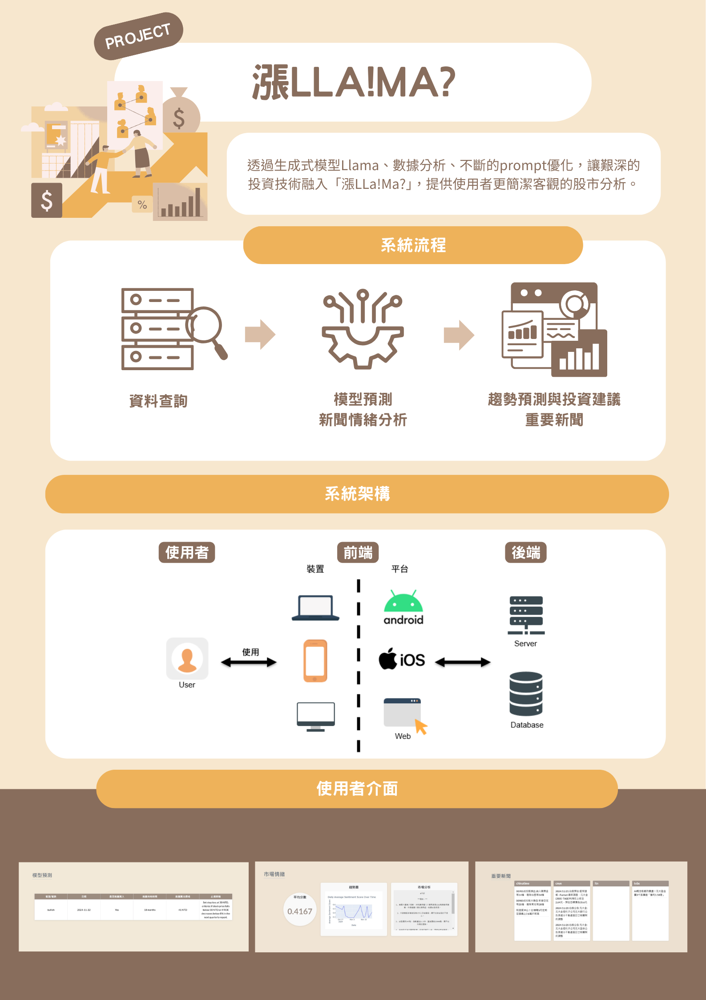

# Fintech LLM Assistant - 金融科技 × LLM 投資情緒分析系統

## 專案簡介

一個結合生成式 AI 技術與金融分析的 Web 應用平台。透過蒐集基本面與財經新聞資料，並利用 BERT 進行情緒分類、LLaMA 模型進行語意理解與推薦生成，最終在網頁平台上提供使用者長期投資建議。

---

## 系統模組說明

- **資料蒐集模組**  
  使用自動化爬蟲技術，蒐集平台新聞資料，以及資料庫內資料作為語言模型分析的輸入來源。

- **情緒分析模組**  
  使用 BERT 預訓練模型進行初步的情緒分類，將文本標記為正向、中立或負向情緒，協助後續語意理解。

- **語意理解與推薦模組**  
  採用 **LLaMA（Large Language Model Meta AI）模型**，進行更深層的語意理解與推論，綜合情緒結果與用戶輸入，生成個股推薦與說明。

- **前端互動平台**  
  建立於 Flask 架構上的 Web 前端，使用者可透過輸入自然語言查詢情境，系統即即時回應推薦股票及其情緒理由。

---

## 系統流程簡述

1. 使用者輸入查詢（如：「2030」）  
2. 系統爬取相關新聞資料，並從資料庫獲取基本面資料
3. 使用 BERT 模型分析情緒傾向  
4. LLaMA 模型理解語意、推理後生成推薦結果  
5. 前端平台呈現推薦股票與理由

---

## 技術使用

本專案整合多項先進技術與工具，涵蓋資料蒐集、自然語言處理、深度學習模型、後端伺服器與前端展示，具體如下：

| 技術名稱                     | 功能說明                                      |
|----------------------------|--------------------------------------------|
| Python                     | 主要開發語言，用於後端邏輯實作與模型整合           |
| Flask                      | 輕量級 Web 框架，負責 API 與前端頁面服務             |
| BERT                       | 使用 Huggingface Transformers 預訓練模型進行情緒分類 |
| LLaMA（Meta AI）            | 大型語言模型，特過提示工程與優話提示詞生成投資建議     |
| 自動化爬蟲                   | 抓取四大平台新聞資料，提供模型分析輸入          |
| Huggingface Transformers    | 管理與調用 BERT 等 NLP 模型                      |
| Supabase                    | 用於資料庫存取及用戶管理（目前暫停連接）             |
| HTML / CSS / JavaScript     | 實現前端互動介面                                  |
| pip & requirements.txt      | 管理專案依賴套件   
---
## 專題海報



---
### DEMO 影片

[](https://youtu.be/MWU4BFyXU1Y)

點擊上圖或連結觀看：[https://youtu.be/MWU4BFyXU1Y](https://youtu.be/MWU4BFyXU1Y)

---

## 環境變數設定

請在專案根目錄建立 `.env` 檔案，並設定以下內容：

```env
TOGETHER_API_KEY=你的 TOGETHER API 金鑰
SECRET_KEY=Flask 的 secret key
SUPABASE_URL=你的 Supabase 專案網址
SUPABASE_KEY=你的 Supabase 金鑰
```

## 執行說明

```markdown
cd senior-project-main/llama_flask

# 安裝依賴
pip install -r requirements.txt

# 執行應用程式
python main.py


**目前不開放連接SUPABASE資料庫，因此以DEMO影片為成果參考。
